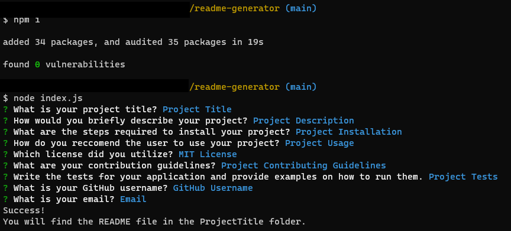

# README Generator 

## Description
The README Generator application allows the user to create a README.md file for their project using Inquirer. 

## Table of Contents

### [Installation](#installation)

### [Usage](#usage)

### [License](#license)

### [Credits](#credits)

### [Contributing](#contributing)

### [Tests](#tests)

### [Questions](#questions)

## Installation
In order to install the project, first the user must clone the repository to their computer. Then the user must have node.js installed in their computer. After these steps are completed, the user must open the directory in which the repository was cloned into. Once there, the user will enter "npm i" into the command line to install the dependencies. Finally the user will initiate the application by running "node index.js" into the command line. 

## Usage
Once the user has initiated the README Generator on their computer, the user will be prompted to answer a series of questions regarding their project. After the user finishes answering the questions, the user will be shown with either a success or error message. If the creation of the README file succeeds, the user should be able to find the file under a folder name matching their project title. 

## License
This application is covered by the [MIT License](https://opensource.org/licenses/MIT).

## Credits
Starter Code: https://github.com/coding-boot-camp/potential-enigma

## Contributing
To contribute to this project, feel free to contact me via my GitHub page or email provided in the section titled Questions. 

## Tests
N/A

## Questions
For any questions please contact me via:

GitHub: [itzelherndz](https://github.com/itzelherndz)

Email: [itzel.hdz208@gmail.com](itzel.hdz208@gmail.com)
